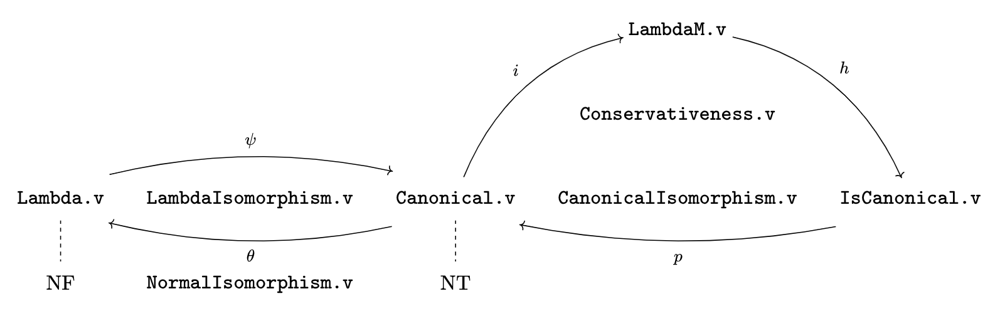

# LambdaM

The multiary lambda calculus is an extension of the ordinary lambda calculus where an applicative term has a list of terms as arguments.

## Meta

- Author(s):
  - Miguel Alves
- Compatible Coq versions: 8.14 or later
- Additional dependencies: autosubst (https://github.com/rocq-community/autosubst/)

## Documentation

### Workflow

The basic workflow for running our scripts is as follows:

1. The user creates a `CoqMakefile` file from the `_CoqProject` file by runnig
   `coq_makefile -f _CoqProject -o CoqMakefile`
2. The user compiles the various scripts in the `theories/` directory by running
   `make -f CoqMakefile` 
3. The user runs any script from the `theories/` directory using any Coq/Rocq environment
4. Optionally, the user may clean the `theories/` directory by running 
   `make clean -f CoqMakefile` 

### Files

A diagram illustrating how the repository is separated into different modules, keeping the methematical essence behind.

The repository contains the following scripts.

- [LambdaM.v](theories/LambdaM.v)  
  Contains definitions for the multiary lambda-calculus.
- [IsCanonical.v](theories/IsCanonical.v)  
  Contains definitions for the canonical subsystem of the multiary lambda-calculus.
- [Canonical.v](theories/Canonical.v)  
  Contains definitions for the self-contaiend canonical subsystem of the multiary lambda-calculus (we also call it canonical lambda-calculus).
- [CanonicalIsomorphism.v](theories/CanonicalIsomorphism.v)  
  Contains the proof of the isomorphism between both representations of the canonical subsystem of the multiary lambda-calculus.
- [Conservativeness.v](theories/Conservativeness.v)  
  Contains the proof that the multiary lambda-calculus is conservative over the canonical lambda-calculus.
- [Lambda.v](theories/Lambda.v)  
  Contains definitions for the simply typed lambda-calculus.
- [LambdaIsomorphism.v](theories/LambdaIsomorphism.v)  
  Contains the proof of the isomorphism between the simply typed lambda-calculus and the canonical lambda-calculus.
- [NormalIsomorphism.v](theories/NormalIsomorphism.v)  
  Contains the proof of the preservation of normal forms by the isomorphism between the simply typed lambda-calculus and the canonical lambda-calculus.

A central script that is not shwon in the diagram is [TypePreservation.v](theories/TypePreservation.v), where the proof for subject reduction of the multiary lambda-calculus is given, and, as consequences, the respective proofs of subject reduction for the canonical lambda-calculus and simply-typed lambda-calculus.

The script [SimpleTypes.v](theories/SimpleTypes.v) contains the inductive defintion for the simple types used.
An auxiliary [MyRelations.v](theories/MyRelations.v) script contains two lemmas to be used when reasoning about reflexive and transitive closures of relations.
